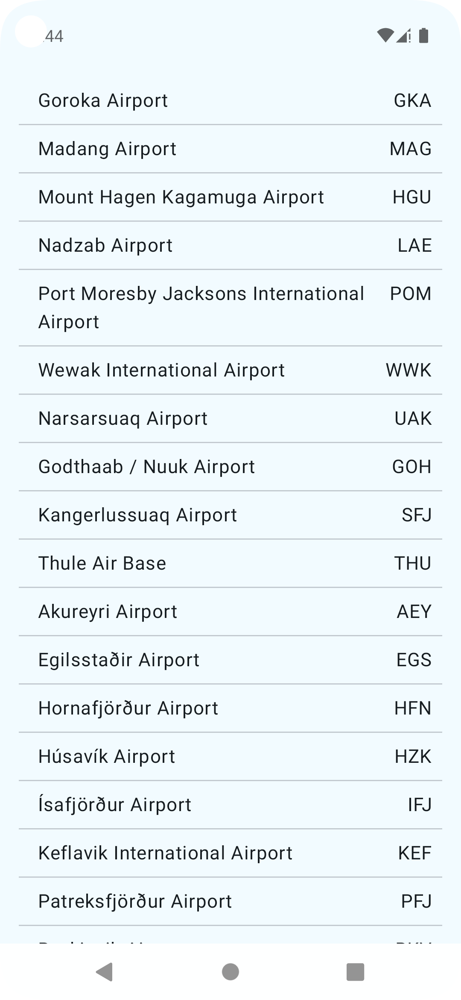
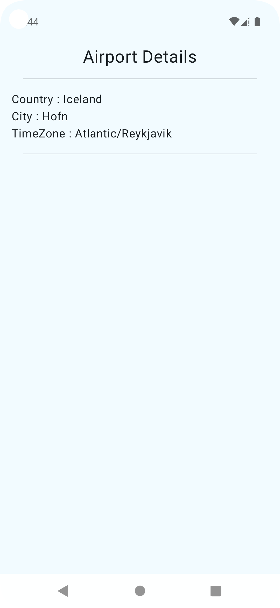

## Architecture and Technologies

- **Architecture**: Implemented using the Model-View-Intent (MVI) architecture pattern to ensure a unidirectional data flow and enhance testability.
- **UI Framework**: Built with Jetpack Compose for a modern, declarative UI approach.
- **Navigation**: Compose Navigation is used to manage navigation between screens.
- **Networking**: Retrofit is used for making API calls.
- **Asynchronous Programming**: Kotlin Coroutines are used for asynchronous operations.

## Screens

### 1. AirPortsListScreen

- **Description**: This screen displays a list of airports.
- **Data Source**: The airports list is fetched from the [Airport Gap API](https://airportgap.com/api/airports).
- **User Interaction**: Tapping on an airport item in the list will navigate the user to the AirPortDetailsScreen.
- **Screen**:

### 2. AirPortDetailsScreen

- **Description**: This screen shows detailed information about a selected airport.
- **API Call**: When navigated to this screen, the app makes an API call to [Airport Gap API](https://airportgap.com/api/airports/AUX) to fetch the details of the selected airport.
- **Screen**:
